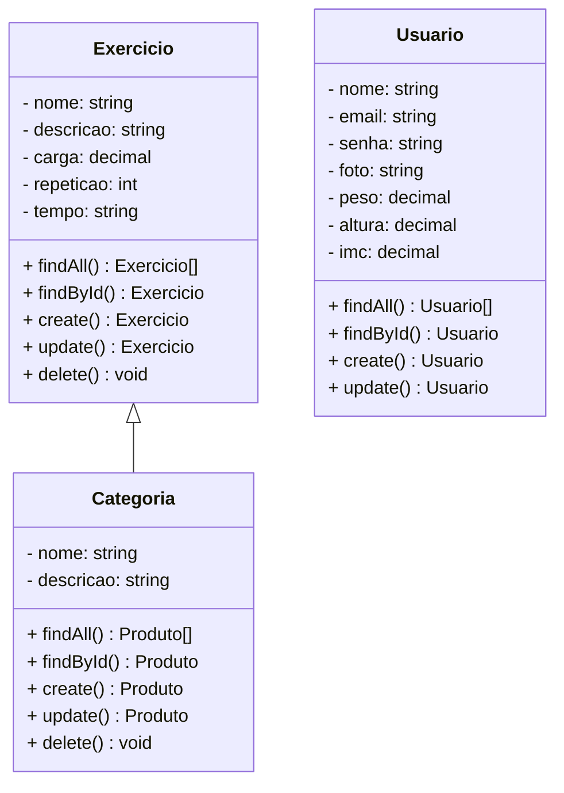

# - Backend

 

  

  

## 1. Descrição

---

## 2. Sobre esta API

### 2.1. Principais Funcionalidades

1.
2.
3.
4.

---

## 3. Diagrama de Classes

---

## 4. Diagrama Entidade-Relacionamento (DER)

Adicione a imagem do Diagrama

    

---

## 5. Tecnologias utilizadas

| Item                          | Descrição  |
| ----------------------------- | ---------- |
| **Servidor**                  | Node JS    |
| **Linguagem de programação**  | TypeScript |
| **Framework**                 | Nest JS    |
| **ORM**                       | TypeORM    |
| **Banco de dados Relacional** | MySQL      |

---

## 6. Configuração e Execução
