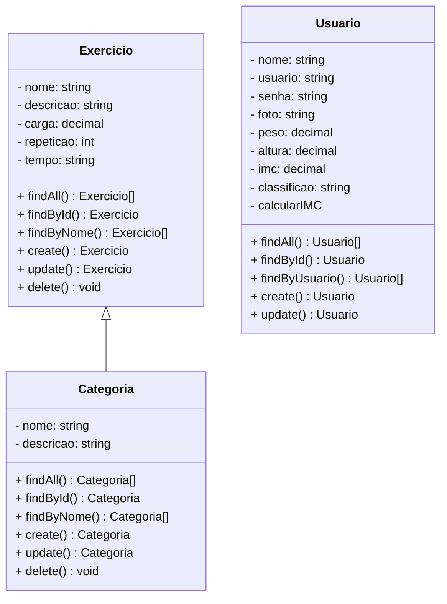
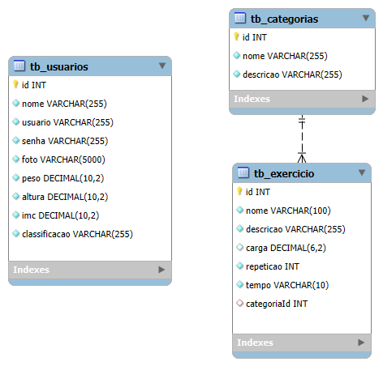

# Move2Fit - Backend

 

  

  

## 1. Descrição

Essa aplicação foi desenvolvida com o objetivo de ajudar pessoas a se organizarem melhor e registrarem os exercícios que realizam na academia. Para isso, oferecemos um sistema completo de cadastro de exercícios, permitindo a categorização detalhada de cada atividade. Além disso, os exercícios podem ser acompanhados por informações como carga utilizada, número de repetições e tempo de execução. Dessa forma, os usuários conseguem manter um histórico preciso e estruturado, evitando que informações importantes, mas muitas vezes esquecidas por serem simples e curtas, se percam ao longo do tempo.

---

## 2. Sobre esta API

API foi criada para fazer gestão de exercícios, cargas, tempo e repetição, onde pode ser registrada essas informações, também deixando-as disponíveis para possíveis alterações e até mesmo exclusão.

### 2.1. Principais Funcionalidades

1. Criação, atualização, buscar geral, busca específica por ID, busca por nome de usuário e o cálculo automático do IMC.
2. Criação, atualização, deleção, busca geral, busca específica por ID e busca por nome de exercício.
3. Criação, atualização, deleção, busca geral, busca específica por ID e busca por nome de categoria.

---

## 3. Diagrama de Classes

---

## 4. Diagrama Entidade-Relacionamento (DER)

  

---

## 5. Tecnologias utilizadas

| Item                          | Descrição  |
| ----------------------------- | ---------- |
| **Servidor**                  | Node JS    |
| **Linguagem de programação**  | TypeScript |
| **Framework**                 | Nest JS    |
| **ORM**                       | TypeORM    |
| **Banco de dados Relacional** | MySQL      |

---

## 6. Configuração e Execução

1. Clone o repositório
2. Configure o arquivo `.env`
3. Instale as dependências `npm i` ou `npm install`
4. Rode o projeto com `npm run start:dev` para ambiente de desenvolvimento
5. Projeto está rodando por padrão em `http://localhost:3000`
